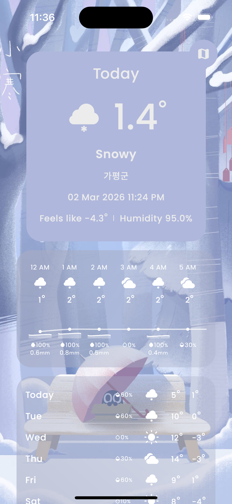
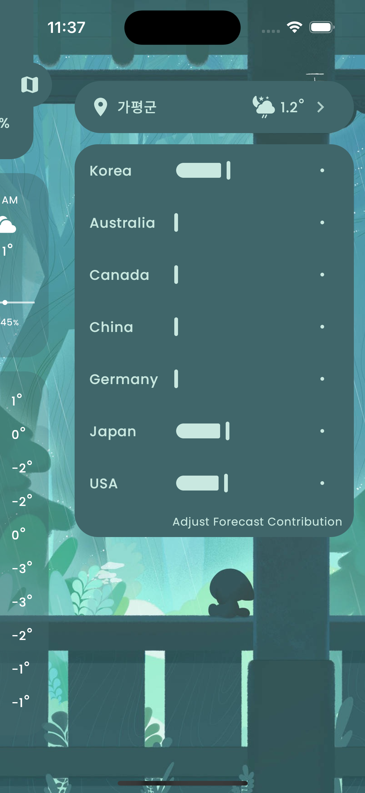
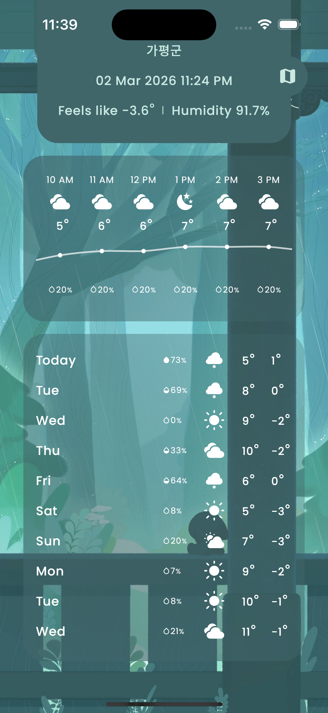
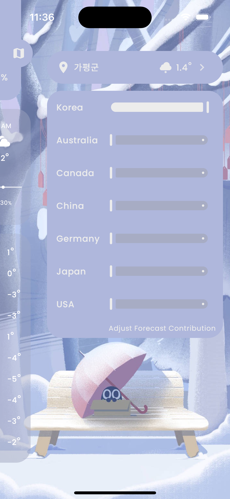
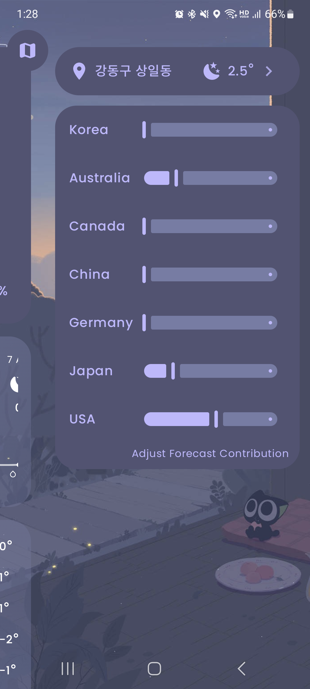
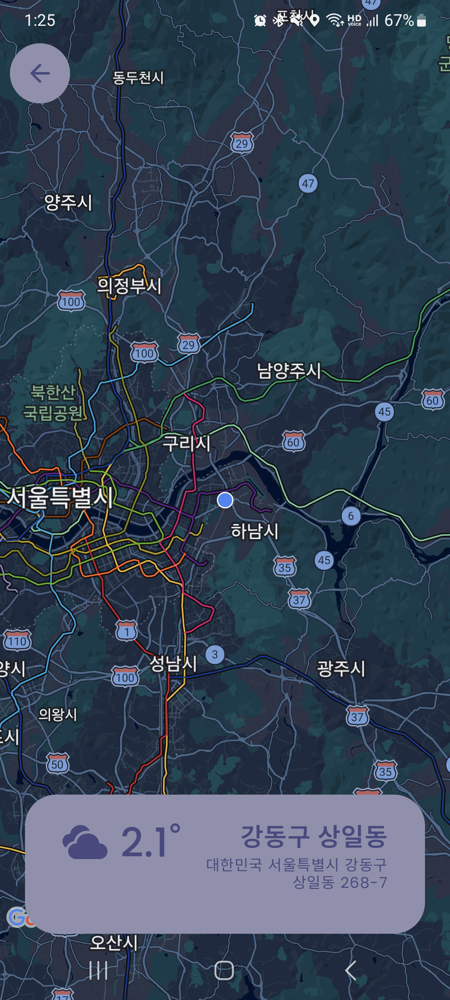
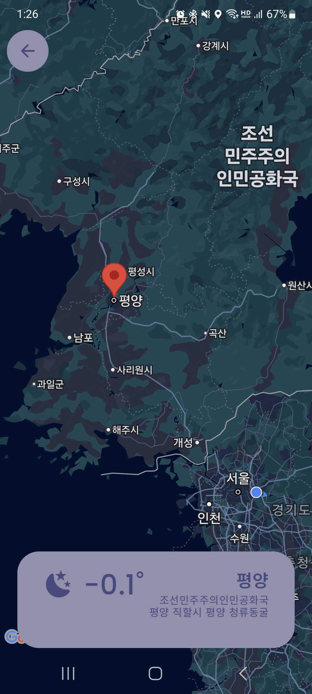

# 이웃 기상청 날씨(NeighborWeather)

<p style="text-align: center;">
  
  
</p>


☀️ 기존 날씨 앱은 하나의 기상청을 통해 날씨 정보를 제공합니다.   
이웃 기상청 날씨는 **여러 국가의 기상 데이터를 조합하여,**   
**유저가 직접 반영 비율을 설정할 수 있는 커스터마이징 날씨 앱**입니다.


<br>

## ✨ 핵심 기능

<p style="text-align: center;">
  
  
  
</p>

<p style="text-align: center;">
  
  
  
</p>

- 현재 위치의 실시간, 시간별, 요일별 날씨 예보 제공
- 지도 화면을 통해 다른 지역의 실시간 날씨 확인 가능
- 날씨 상태와 시간대에 따라 동적으로 변경되는 테마 시스템
- 여러 국가의 기상 데이터를 통합하고, 사용자 설정 비율에 따라 가중합 계산

<br>

## 👤 담당 역할

- 1인 개발
    - Kotlin Multiplatform 프로젝트 환경 구축
    - 앱 아키텍쳐 설계
    - Android / iOS UI 개발
    - 주요 기능 구현

<br>

## **🔧 주요 개발 내용**

### 유저 가중치 기반 날씨 데이터 통합

- 여러 국가의 날씨 예보 데이터를 단순히 나열하는 것이 아니라 정규화 및 가중합 계산으로 하나의 날씨 데이터로 통합
- 각 기상청의 예보 데이터를 온도, 강수 확률, 습도, 풍속 등 단위 별로 나눠서 정규화
- 유저가 설정한 기상청 가중치 비율대로 가중합을 계산
- 기상청 가중치 값은 Android에선 `SharedPreferences`, iOS에선 `NSUserDefaults`로 저장
- ```WeatherScore = Σ (NormalizedWeather_i × UserWeight_i)```

### 동적으로 변하는 날씨 테마

- Compose의 `colorScheme` 관리를 이용해 날씨 상태와 시간대에 따라 앱 전체 `ColorScheme`이 전환되도록 구현
- MVI 기반으로 기상청 가중치 값 변경시 UI에 반영
- OS 라이트/다크 모드 변화를 감지하여 UI에 반영

### Kotlin Multiplatform 기반 크로스 플랫폼

- Android 개발 경험을 그대로 활용 가능한 크로스 플랫폼 프레임워크라서 선택
- 비즈니스 로직 코드 100% 공유
- UI 코드 85% 공유
- Google Maps는 각 플랫폼별로 따로 구현하여 플랫폼 의존성 최소화

### Offline-first 설계

- 네트워크가 불안정한 상황을 고려해 Local DB를 Single Source Of Truth(SSOT)로 사용하는 구조 설계
- ViewModel에서 Repository로 데이터 요청시, Local DB flow를 전달
- 그 뒤 Remote API를 호출
- 성공시 Local DB에 갱신하여 flow를 통해 UI에 반영

<br>

## 🏗️ 아키텍쳐


### Feature 단위 디렉토리 분리

- core / weather / home / map 등 Feature 단위로 디렉토리를 분리
- 각 Feature 내부에서 Presentation / Domain / Data 구조 유지
- 새로운 Feature 추가 시 기존 코드 수정 없이 독립적으로 추가 가능

### Clean Architecture

- Presentation / Domain / Data 계층 분리
- Presentation Layer
    - Compose Multiplatform으로 만든 UI
    - ViewModel에서 상태 관리
    - UI는 비즈니스 로직에 직접 접근하지 않음
- Domain Layer
    - Entity, Repository Interface 정의
    - 앱의 핵심 비즈니스 로직을 담당
    - 의존성은 항상 안쪽으로 향함 (Presentation → Domain ← Data)
- Data Layer
    - Repository 구현
    - Remote / Local Data Source 통합 관리

### MVI Architecture

Presentation Layer는 MVI 기반으로 구성되어있음

- State를 통해  화면의 모든 UI 상태를 관리
- Event로 사용자의 입력 이벤트 처리 (=Intent)
- Effect로 네비게이션, 토스트 등 일회성 이벤트 처리
- Single Source of Truth (SSOT) ****유지
- Unidirectional Data Flow (UDF) 적용

<br>

## 🛠️ 기술 스택

| **Category** | **Tech Stack** |
| --- | --- |
| **Language** |   |
| **Framework** |   |
| **Platform** |   |
| **Architecture** |    |
| **Async** |   |
| **Local Data** |  |
| **Networking** |   |
| **Dependency Injection** |  |
| **Android Jetpack** |   |
| **External API** |  |

<br>

## **🧩 문제 해결 경험**

### **🔹플랫폼별 Google Maps 통합 문제**

**문제점**

- Android와 iOS SDK 차이로 `commonMain`에서 직접 제어 불가

**해결 방법**

- KMP의 expect/actual 메커니즘을 활용
- 플랫폼 공통 `GoogleMaps` expect 인터페이스를 정의
- Android에서는 `google-maps-compose`를 래핑하여 구현
- iOS에서는 Google Maps를 제어하는 UiKit를 compose UiKitView로 감싸서 구현

**결과**

- 다른 공통 UI들과 호환이 되는 `GoogleMaps` UI를 구현
- 플랫폼 의존 코드를 최소화함

### **🔹iOS 지도 화면에서 터치가 안 되는 문제**

**문제점**

- navigation compose 버전 업데이트 후부터 UIKitView가 터치 입력을 전달받지 못하는 현상 발생

**해결 방법**

- compose-multiplatform의 GitHub issue를 확인하여 정확히 문제 인지
- 낮은 버전의 navigation compose에선 UiKitView의 default 파라미터 설정이 달라서 외부의 composable에서 터치 입력을 소모하지 않게 됨
- navigation compose 라이브러리를 다운그레이드 하여 문제를 해결

**결과**

- iOS 지도 화면에서 터치 입력이 UiKit로 제대로 전달
- 라이브러리 버전 관리의 중요성을 체감함

<br>

## **🔄 개선 방향**
### **🔹Ktor Darwin UTF-8 파싱 오류**

**문제점**

- iOS에서 Ktor가 간혹가다  UTF-8 string 파싱에 실패하는 에러 발생
- GitHub issue를 확인하니 Ktor dawin iOS 라이브러리가 베타 버전이라 처리 가능한 charset이 제한되어있다는 것을 알게 됨
- 같은 오류 발생 시, 그 데이터 제외 후 나머지 데이터만 사용하여 보강하도록 임시 조치

**개선 방향**

- KMP와 Ktor 안정화 이후 이 이슈가 해결됨을 확인하면 버전을 업그레이드할 예정

**배운 점**

- 크로스 플랫폼은 생산성을 높이지만 안정성 리스크가 존재한다는 것을 알게 됨
- 
<br>

## 🔗 링크

- **Notion**  
  https://bouncy-rover-a1d.notion.site/318f88e182a580e79bafde11a2680c50?pvs=74
